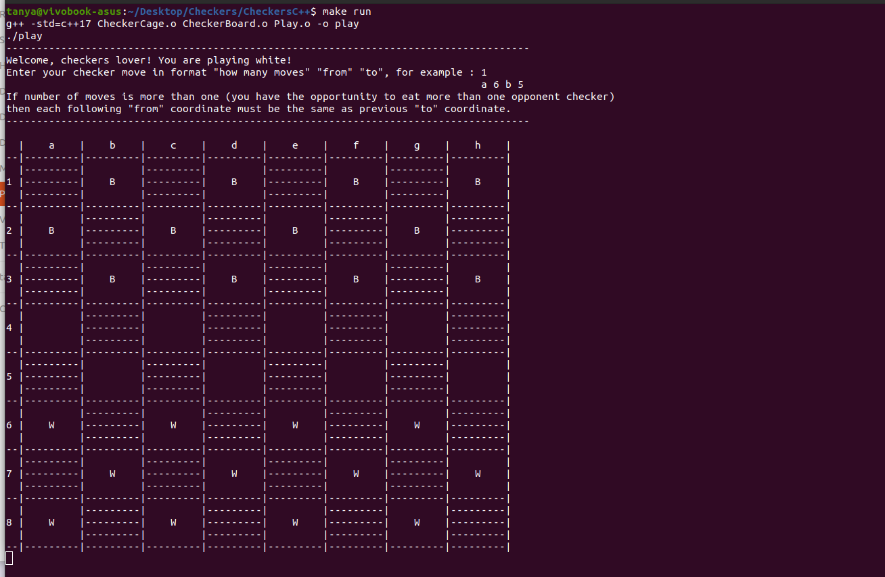

# Бот для игры в шашки.

Для игры с виртуальным соперником вам понадобится лишь запустить скачанный проект (см. пункт "Для запуска").
После запуска вам представится такая картина:

Белые поля шахматной доски отрисованы метками, черные поля не закрашены.
Буква W (white) означает, что на клетке стоит шашка белого цвета, 
а бука B (black) - черного. По умолчанию пользователь играет белыми.
Все что нужно делать - следовать инструкциям на экране.
- --

# Правила.

Правила игры ничем не отличаются от обычных шашек. Но есть несколько условий.
Во первых, нужно указывать количество ходов, даже если он всего один, в формате:
"клетка, откуда перемещаем шашку" "клетка, куда перемещаем шашку".
Во вторых, если вы хотите сделать несколько ходов подряд и имеете возможность съесть несколько
черных шашек противника, то указывайте ходы последовательно.

Например:

3 

a 6 c 4

c 4 e 6

e 6 g 4

Если вы захотите досрочно закончить игру, то после очередного хода введите "exit".
Если хотите продолжать, после каждого хода необходимо вводить "ok".

- --

# Для запуска:

 - Склонировать репозиторий
 - Зайти в папку CheckersC++
 - Выполнить одну из двух комбинаций команд в терминале:
   - make run
   - make all, затем ./play
 - --
